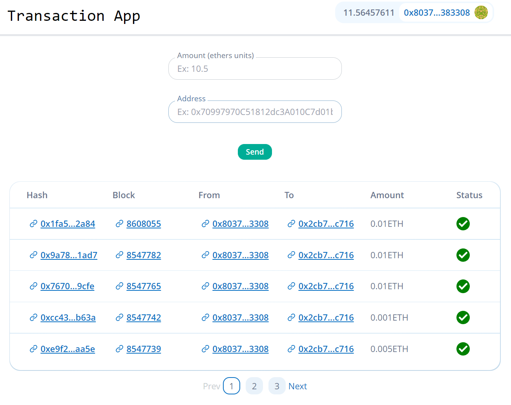

# TransactionApp

<br />
<div align="center">
<h1 align="center">TransactionApp</h1>
  <p align="center">
    Web3 app to send tokens to any address.
  </p>
</div>

<p align="center">
  
</p>

<!-- TABLE OF CONTENTS -->
<!-- <details> -->
  <summary>Table of Contents</summary>
  <ol>
    <li><a href="#launch-the-app-localy">Launch the app localy</a></li>
  </ol>
<!-- </details> -->

<!-- Launch the app localy -->

## Launch the app localy

  <summary>Required</summary>
  The following must be installed in order to run locally.
  <ol>
    <li><a href="https://nodejs.org/en/download/?utm_source=blog">Next.js</a></li>
    <li>npm (installed with Node.js)</li>
  </ol>

Then follow the instructions.

```sh
# In one terminal
$ cd App
$ npm run dev
```

In your brower you can now go to http://localhost:3000/ and connect your wallet.<br />
(⚠️ For now only Metamask wallet is supported)

<p align="right">(<a href="#top">back to top</a>)</p>
